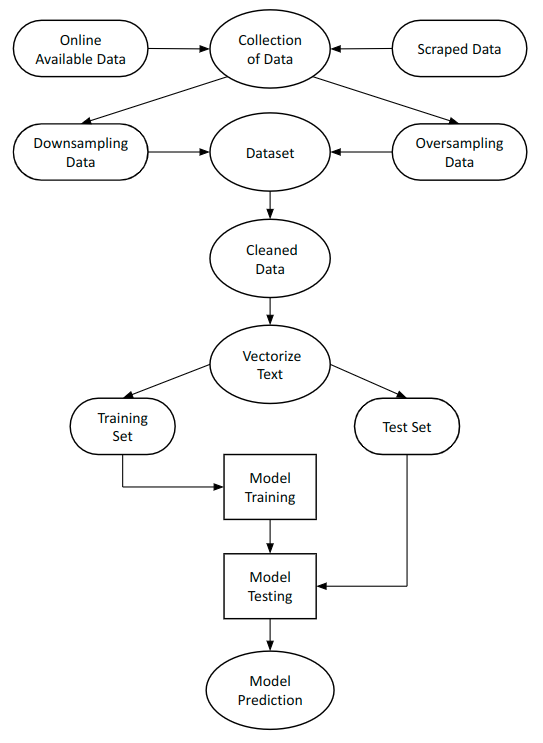
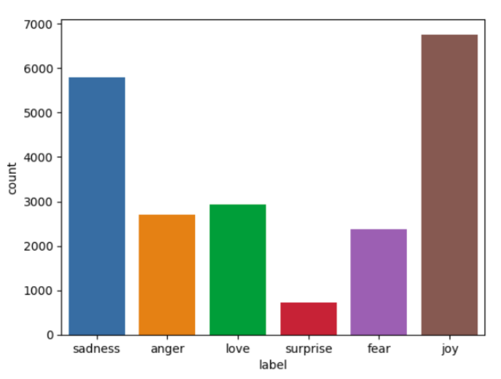
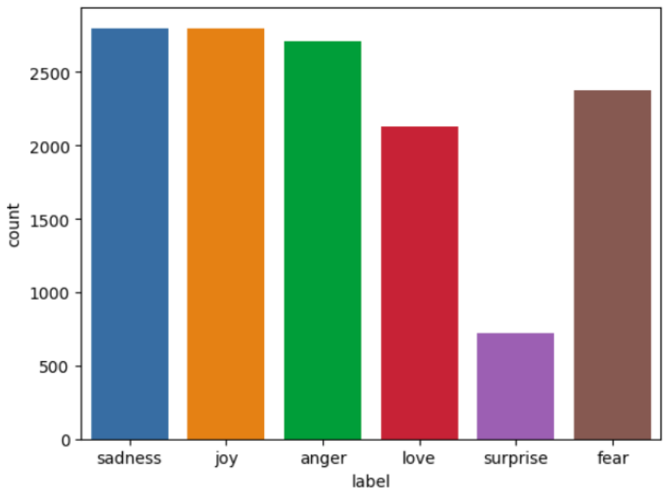
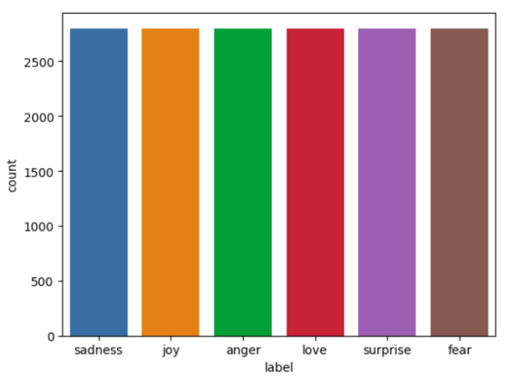
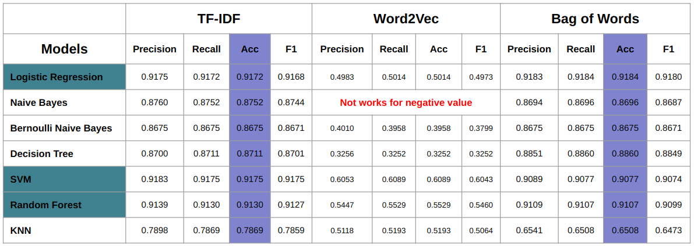
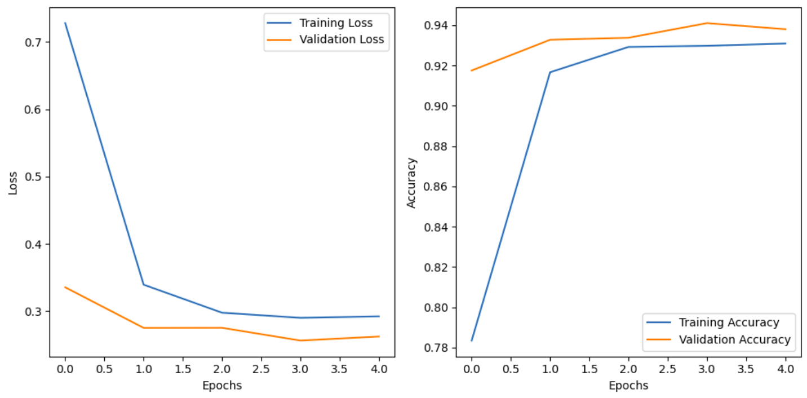
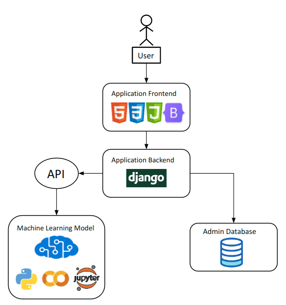

# Emotion Detection Form Text Using ML and Transformer (BERT) model

Sentiment classification is a crucial task in natural language processing that aims to automatically identify the sentiment class that is expressed in text documents. This project focuses on utilizing machine learning and NLP based techniques to perform sentiment classification and explores the effectiveness of various algorithms in accurately predicting sentiment. The project contains a dataset of labeled texts encompassing sadness, love, joy, surprise, fear, and anger sentiments. These models include classifiers such as Support Vector Machines (SVM), Logistic Regression, Naive Bayes, Bernoulli Naive Bayes, Random Forest, K-Nearest Neighbors, and Decision Tree and a transformer model BERT. The project also investigates the impact of different feature representations, such as Bag-of-words, TF-IDF, and Word2Vec, on classification performance. The experimental results demonstrate the efficacy of machine learning algorithms and transformer based model in sentiment classification tasks, with certain models outperforming others in terms of accuracy, precision, recall, and f1-score. The findings of this project contribute to the broader field of sentiment analysis and provide valuable information for developing sentiment classification systems in real-world applications.

    
## Table of contents
* [Dataset Creation](#dataset-creation)
* [System Design](#system-design)
    * [Data Cleaning](#data-cleaning)
    * [Data Sampling (For handling imbalance)](#data-sampling-for-handling-imbalance)
    * [Feature Extraction and Target Transformation](#feature-extraction-and-target-transformation)
* [Modeling and Results](#modeling-and-results)
* [Integration with Application](#integration-with-application)
* [Application Demo](#application-demo)
* [Installation Process](#installation-process)
* [Technologies Used](#technologies-used)


## Dataset Creation
I have used wab scraping to increase the amount of data in my dataset. Most of the texts are from social media and blogs. I have used `beautifullsoup` python package for web scraping. After extracting around 1000 text data, I have added these to the main data.


## System Design
Following is the diagram that defines the workflow of this project. I have used a [Kaggle dataset](https://www.kaggle.com/datasets/parulpandey/emotion-dataset) which is the collection of twitter text. The data required a thorough analysis before preprocessing. As this dataset is created by scraping website, it will contain unnecessary data like punctuations, stopwords, links, user handles etc. To mitigate this issue I have done several preprocessing steps to clean the text data. You will find the steps in the following diagram.

<div align="center">
    <a href="">
      
    </a>
</div>


#### Data Cleaning
I have used `neattext` and `re` python library for cleaning data. `neattext` library helped me to remove stopwords, punctuations and links. `re` package is used for removing user handles from the text.

#### Data Sampling (For handling imbalance)
After building the final version of the dataset, I have done a through analysis and found out that it has some imbalance classes, which can make the training bias. In order to resolve this issue, I have used `imblearn` library to apply oversampling to the classes that has lesser datapoints and I have also chopped off some data for making the dataset balanced as those classes contained significantly higher number of datapoints.

<p align="center">
  
  
  
</p>

#### Feature Extraction and Target Transformation
It is a process of representing the text in numeric numbers. I have tested 3 types of vectorization techniques.

  *  Bag of Words
  *  TF-IDF
  *  Doc2Vec

I have used `OneHotEncoding` to encode the targets.


## Modeling and Results
The table shows the performance of different machine learning models across three text vectorization methods: TF-IDF, Word2Vec, and Bag of Words. The models evaluated are Logistic Regression, Naive Bayes, Bernoulli Naive Bayes, Decision Tree, SVM, Random Forest, and KNN. Four metrics are provided for each: Precision, Recall, Accuracy (Acc), and F1-score (F1).

**TF-IDF**: SVM achieved the highest accuracy (0.9175), followed closely by Logistic Regression and Random Forest with the same score.

**Word2Vec**: Word2Vec doesn't work with Naive Bayes due to negative values. The best performing model is SVM with an accuracy of 0.6089, though this is lower compared to TF-IDF and Bag of Words results.

**Bag of Words**: SVM and Random Forest achieved the highest accuracy (0.9077 and 0.9107, respectively), with Random Forest having a slightly higher F1-score.

The **best overall result** in terms of accuracy and F1-score was achieved by **Logistic Regression with Bag of Words** (Accuracy: 0.9184, F1-score: 0.9180).

<div align="center">
    <a href="">
      
    </a>
</div>


Following table contains the evaluation parameters value for BERT model.

<center>

|  Model  | Training Accuracy | Test Accuracy | Precision |  Recall  | F1-Score |
|:-------:|:----------------: |:-------------:|:---------:|:--------:|:--------:|
|  BERT   |       0.9309      |     0.9410    |  0.9397   |  0.9380  |  0.9376  |

</center>

Considering the computational power, I have chosen the Logistic Regression model over BERT, although Logistic Regression achieved <strong>92%</strong> accuracy which is less that BERT. I made such choice because, machine learning model is more efficient choice when computational power is concerned.


### ROC Curve
The ROC curve compares multiple machine learning models' performance by plotting the true positive rate against the false positive rate, with their AUC values indicating the effectiveness of each model. Logistic Regression, SVM, and Random Forest achieved the highest AUC of 0.99, showing the best overall performance, closely followed by Naive Bayes and Bernoulli Naive Bayes with AUC values of 0.98. The Decision Tree performed moderately with an AUC of 0.93, while KNN had the lowest performance with an AUC of 0.88. Overall, Logistic Regression, SVM, and Random Forest demonstrated the most robust classification capabilities based on this metric.

<div align="center">
    <a href="">
      
    </a>
</div>


### Training result of BERT
The training curves for the BERT model show the loss and accuracy trends over 5 epochs. The left plot illustrates a sharp decline in both training and validation loss, with the training loss dropping significantly in the first epoch and stabilizing around 0.3 after the third epoch, while the validation loss plateaus early. The right plot depicts the accuracy, where both training and validation accuracy improve rapidly, with training accuracy approaching 0.94 by the fourth epoch and validation accuracy stabilizing around 0.92 after the second epoch. Overall, the model demonstrates good convergence with minimal overfitting, as both training and validation metrics are closely aligned.

<div align="center">
    <a href="">
      
    </a>
</div>


### Comparison of Classification Matrix of Logistic Regression
The confusion matrices illustrate the performance of a BERT model (left) and a Logistic Regression model (right) for emotion classification. The BERT model shows strong performance with almost perfect classification in sadness (27 correct predictions) and joy (33 correct predictions), but struggles with emotions like surprise and fear, where it confuses fear as joy. Meanwhile, the Logistic Regression model handles a larger dataset, achieving high accuracy across all emotions, especially for sadness, joy, and surprise, as indicated by the high diagonal values. However, it has some misclassifications, particularly between anger and fear, and between joy and love. Overall, while BERT performs well on this smaller dataset, Logistic Regression shows better generalizability with larger data.

<p align="center">
  
  
</p>


## Integration with Application
Following is the system diagram of the the application that I have developed using HTML, CSS, JavaScript, Django in order to deploy the model.

<div align="center">
    <a href="">
      
    </a>
</div>


## Application Demo
Here is the video of the application in action.


## Installation Process
In order to run this application you just need to clone this repository, create an python environment and install the requirements.

Command for creating and activating python environment. You can use different ways to create your environment.
```python
conda create -n <env_name>
conda activate <env_name>
```

Execute the following command for installing the required libraries.
```python
pip install -r requirements.txt
```

Now, you are all set to run the application.

```python
python manage.py runserver
```


## Technologies Used
We have used several python libraries and frameworks for different purposes.

- [pandas, numpy, matplotlib, searborn] - These are used for exploratory data analysis.
- [scikit-learn] - It is a machine learning frameworks equipped with tools to build models. We have used it in data preprocessing and result analysis. All the evaluation parameters values are produced with the help of this library.
- [django] - We have buid a web application to deploy our trained model.
- [HTML, CSS, Bootstrap] - Website frontend design.


## License
[MIT](LICENSE)
